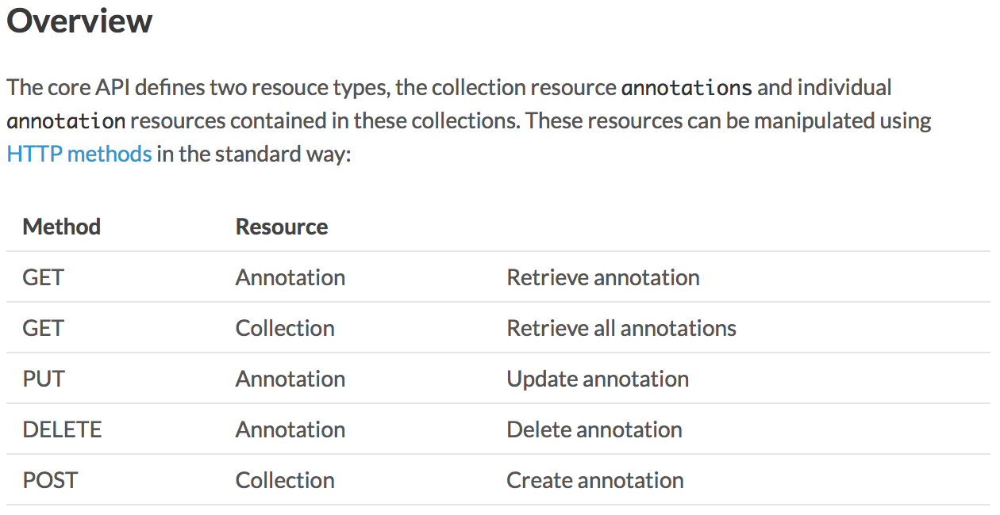
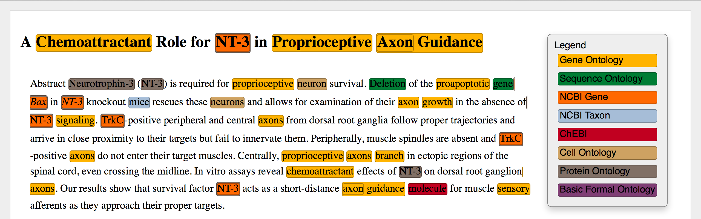
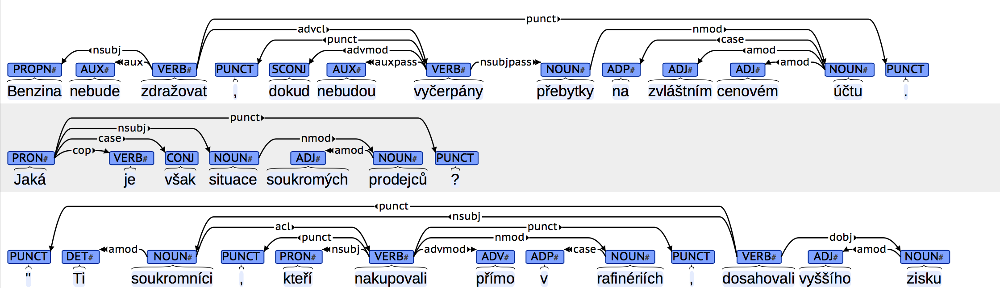
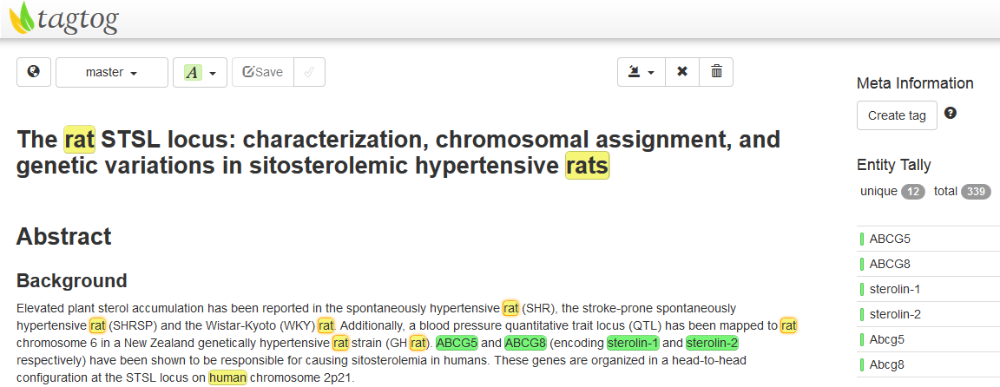

RESTful Open Annotation (REST-OA) provides a simple API for sharing
annotations online together with reference implementations and tools
and resources implementing the API.

---

## Specification

The formal specification of the RESTful Open Annotation API.

* Homepage: <http://restful-open-annotation.github.io/spec>

---

## Reference implementation

Reference server and client implementations plus tools for format
conversion and validation.

### Store

Server-side annotation storage that allows clients to create, read,
update and delete annotations using the API.

* Homepage: <https://github.com/restful-open-annotation/eve-restoa>
* Example: <http://weaver.nlplab.org/api/annotations/1>

### Explorer

Client that provides an HTML interface for navigating and visualizing
the contents of any compatible store.

* Homepage: <http://weaver.nlplab.org:7000/explore>
* Example: [visualize CoNLL'02 document](http://weaver.nlplab.org:7000/explore?url=http%3A//weaver.nlplab.org%3A5000/annotations&doc=http%3A//weaver.nlplab.org/api/documents/esp.train-doc-1.txt&style=visualize)

### Adapter

Middleware for sharing OA data. Implements both the client and server
sides of the API and a conversions to and from different
serializations of the OA model and related formats.

* Homepage: <https://github.com/restful-open-annotation/oa-adapter>

### Validation

Support for OA JSON data validation is provided using
[JSON Schema](http://json-schema.org/).

* Homepage: <https://github.com/restful-open-annotation/schema>

---

## Tools and resources

### brat

brat rapid annotation tool is an open-source web-based annotation
tool. Both the brat client and server implement experimental REST-OA
support.

* Homepage: <http://brat.nlplab.org>

### tagtog

tagtog is a web-based annotation system designed to combine manual and
automatic annotations to accurately and efficiently mark up full-text
articles. Both the tagtog client and server implement experimental
REST-OA support.

* Homepage: <https://www.tagtog.net/>

### Biomedical entity recognition resources

TODO

* Homepage: <https://TODO.org>

### EVEX

TODO

* Homepage: <http://evexdb.org/>

---
